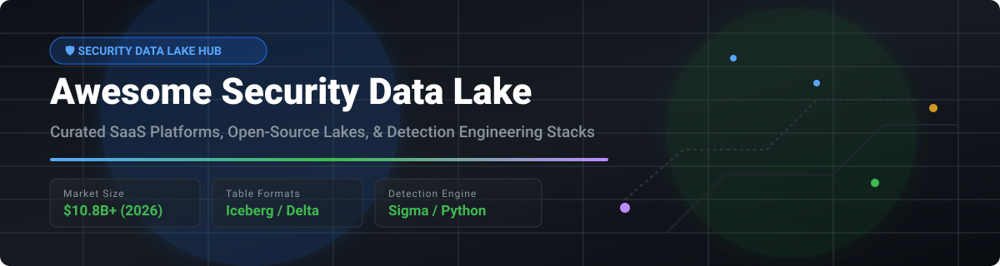

# 🛡️ Awesome Security Data Lake <a href="https://github.com/ishandutta2007/Awesome-Awesome-Awesome"></a><a href="https://discord.gg/jc4xtF58Ve"></a> [](https://github.com/ishandutta2007/Awesome-Awesome-Awesome) <a href="https://github.com/ishandutta2007"></a>



## 📊 Top Security Data Lake Ecosystem & Architecture Guide

> **A Curated List of SaaS Security Analytics Platforms, Open-Source Data Lakes, Detection Engineering Frameworks & Telemetry Pipelines.**  
> *Centralizing petabyte-scale security telemetry for threat detection, incident response, SIEM modernization, and compliance cost-effectively.*  
> **📅 Last updated: October 2026**

---

## 🔍 Overview & Architecture

Modern **Security Data Lakes** combine the elastic, low-cost storage economics of cloud lakehouses (built on **Apache Iceberg**, **Delta Lake**, and **AWS S3**) with high-performance analytics engines (**Trino**, **Apache Spark**, **ClickHouse**, **DuckDB**) and detection-as-code frameworks (**Sigma**, **Python**). This architectural shift decouples security data ingestion and storage from traditional high-cost SIEM indexing models.

---

## 📚 Table of Contents

- [📊 Market Overview & Industry Dynamics](#-market-overview--industry-dynamics)
- [☁️ SaaS / Hosted Security Data Lake Platforms](#%EF%B8%8F-saas--hosted-security-data-lake-platforms)
- [🔓 Open-Source GitHub Projects](#-open-source-github-projects)
  - [🛡️ Security Data Lake & SIEM Platforms](#%EF%B8%8F-security-data-lake--siem-platforms)
  - [⚡ Table Formats & Analytical Query Engines](#-table-formats--analytical-query-engines)
  - [🎯 Detection Engineering & Threat Intelligence](#-detection-engineering--threat-intelligence)
  - [📡 Network & Endpoint Telemetry Ingestion](#-network--endpoint-telemetry-ingestion)
  - [🔄 Log Pipelines & Telemetry Collectors](#-log-pipelines--telemetry-collectors)
- [🏗️ Architectural Reference Blueprint](#%EF%B8%8F-architectural-reference-blueprint)
- [🤝 How to Contribute](#-how-to-contribute)
- [⚠️ Enterprise Implementation & Cost Disclaimer](#%EF%B8%8F-enterprise-implementation--cost-disclaimer)
- [💖 Support & Community](#-support--community)
- [📈 Star History](#-star-history)

---

## 📊 Market Overview & Industry Dynamics

> 💡 **Market Size & Fragmenting Landscape**:  
> The Global **Security Data Lake and Next-Gen Cloud SIEM Market** is estimated at **$10.8 Billion (2026)** and is projected to expand at a CAGR of 18.4% through 2030.  
> **Market Fragmentation Status**: The sector is **moderately concentrated among tier-1 tech giants** (Microsoft, Google, AWS, Splunk/Cisco), but is experiencing **high fragmentation at the analytics and detection tier**. Specialized lakehouse vendors (Panther, Snowflake, Databricks) and open-source table formats (Apache Iceberg) are breaking down traditional proprietary SIEM silos, enabling enterprise SOCs to execute a "bring-your-own-storage" decoupled security strategy.

---

## ☁️ SaaS / Hosted Security Data Lake Platforms

The table below highlights leading commercial SaaS and cloud-hosted Security Data Lake platforms, ordered by **Company Scale (Market Cap / Valuation / Revenue)** descending.

| 🏢 Platform / Vendor | 💰 Company Scale (Cap / Rev / Val) | 🏷️ Specific Starting Tier Pricing | 🎁 Free Tier Limit / Trial Details | 🎯 Key Capabilities & Best For |
| :--- | :--- | :--- | :--- | :--- |
| **[Microsoft Sentinel](https://azure.microsoft.com/en-us/products/microsoft-sentinel)** | **~$3.1 Trillion** *(Market Cap)* | **$4.30 / GB ingested** *(Pay-As-You-Go commitment-free starting tier)* | **5MB/day free ingestion** per log type + **30-Day Free Trial** with **$200 Azure credits** & up to **10 GB/day** free ingestion | Cloud SIEM & Security Lake integrated with Azure & Microsoft 365. Best for Microsoft-centric enterprise SOCs. |
| **[Google Chronicle](https://cloud.google.com/chronicle)** | **~$2.2 Trillion** *(Market Cap)* | **$45,000 / year** *(Starting fixed-price ingest tier up to ~1TB/day)* | **30-Day Free Trial** on Google Cloud Platform with **$300 free credits** | Petabyte-scale cloud-native security analytics with UDM normalization & YARA-L detection engine. Best for massive telemetry scale. |
| **[Amazon Security Lake](https://aws.amazon.com/security-lake/)** | **~$2.1 Trillion** *(Market Cap)* | **$0.25 / GB ingested** *(AWS S3 / Glue data processing fee)* | **30-Day Free Trial** with full automated OCSF normalization and source ingestion across AWS accounts | AWS-native serverless security lake centralizing AWS logs into open OCSF format on Apache Iceberg. Best for AWS cloud environments. |
| **[Splunk Enterprise Security](https://www.splunk.com/en_us/products/enterprise-security.html)** | **~$28 Billion** *(Cisco Acquisition)* | **$1,800 / year** *(Base Workload Unit pricing starting tier)* | **60-Day Free Trial** of Splunk Enterprise (up to **500 MB/day** local indexing limit) | The enterprise SIEM standard with mature UEBA, risk-based alerting, and SOAR integration. Best for complex enterprise SOCs. |
| **[Snowflake Cybersecurity](https://www.snowflake.com/)** | **~$50 Billion** *(Market Cap)* | **$2.00 / Snowflake Credit** *(Standard Edition starting compute consumption)* | **30-Day Free Trial** with **$400 in free Snowflake usage credits** | Elastic data lakehouse analytics enabling custom SQL-based detection & security telemetry centralization. Best for existing Snowflake data teams. |
| **[Databricks Lakehouse Security](https://www.databricks.com/)** | **~$43 Billion** *(Private Valuation)* | **$0.15 / DBU** *(Databricks Unit starting pay-as-you-go serverless rate)* | **14-Day Free Trial** on AWS/Azure/GCP with **1,000 free DBU credits** | AI-driven lakehouse security analytics utilizing Delta Lake, MLflow, and Spark for anomaly detection. Best for data-science security teams. |
| **[Elastic Security](https://www.elastic.co/security)** | **~$9 Billion** *(Market Cap)* | **$95 / month** *(Elastic Cloud Standard starting tier)* | **14-Day Free Trial** on Elastic Cloud (fully featured deployment, no credit card required) | SIEM, endpoint protection, and security analytics on Elasticsearch engine. Best for Elastic stack teams. |
| **[Sumo Logic Cloud SIEM](https://www.sumologic.com/solutions/cloud-siem/)** | **~$1.7 Billion** *(Private Equity)* | **$3.00 / GB ingested** *(Essentials Log Analytics starting tier)* | **30-Day Free Trial** with up to **1 GB/day** ingestion limit & **30-day retention** | SaaS cloud-native SIEM with automated threat detection and incident correlation. Best for cloud-first devops & SOC teams. |
| **[Devo Platform](https://www.devo.com/)** | **~$1.5 Billion** *(Private Valuation)* | **$2.50 / GB ingested** *(Starting cloud log ingestion tier)* | **30-Day Free Trial** (up to **10 GB/day** log ingestion limit for test environments) | High-velocity cloud-native security data platform with real-time ingestion & hot storage queries. Best for high-volume enterprise logs. |
| **[Panther Labs](https://panther.com/)** | **~$1.0 Billion** *(Private Valuation)* | **$30,000 / year** *(Panther Enterprise Base Tier starting plan)* | **30-Day Free Trial** sandbox environment for testing Python detection rules & AWS log connectors | Cloud-native SIEM built on Snowflake & S3 with detection-as-code in Python. Best for modern engineering-led SOCs. |

---

## 🔓 Open-Source GitHub Projects

Below are top-tier open-source GitHub projects powering modern security data lakes, analytics, and telemetry pipelines, sorted by **GitHub Stars_Count** (descending). Stars_Count badges link directly to each repository's stargazers page.

### 🛡️ Security Data Lake & SIEM Platforms

- **[elastic/elasticsearch](https://github.com/elastic/elasticsearch)** [](https://github.com/elastic/elasticsearch/stargazers)  
  **Distributed, RESTful search and analytics engine** · ELv2/SSPL licensed · Heart of the Elastic Security stack for log search, indexing, and SIEM detections.
- **[wazuh/wazuh](https://github.com/wazuh/wazuh)** [](https://github.com/wazuh/wazuh/stargazers)  
  **The leading open-source security platform for threat prevention, detection, and response** · GPLv2 licensed · Native XDR and SIEM capabilities, FIM, vulnerability detection, and 1,000+ MITRE ATT&CK rules.
- **[opensearch-project/OpenSearch](https://github.com/opensearch-project/OpenSearch)** [](https://github.com/opensearch-project/OpenSearch/stargazers)  
  **Community-driven open-source search and analytics suite** · Apache-2.0 licensed · Includes OpenSearch Security Analytics with built-in Sigma rules, correlation engine, and anomaly detection.
- **[matanolabs/matano](https://github.com/matanolabs/matano)** [](https://github.com/matanolabs/matano/stargazers)  
  **Open-source serverless security data lake for AWS** · Apache-2.0 licensed · Ingest petabytes of logs into Apache Iceberg Parquet files on AWS S3 with Python detection-as-code and Rust log transformation.

### ⚡ Table Formats & Analytical Query Engines

- **[ClickHouse/ClickHouse](https://github.com/ClickHouse/ClickHouse)** [](https://github.com/ClickHouse/ClickHouse/stargazers)  
  **High-performance open-source columnar database** · Apache-2.0 licensed · Popular for real-time security telemetry storage, fast log aggregation, and custom security analytics.
- **[apache/spark](https://github.com/apache/spark)** [](https://github.com/apache/spark/stargazers)  
  **Unified analytics engine for large-scale data processing** · Apache-2.0 licensed · Batch and stream processing engine for petabyte-scale security data lakes.
- **[duckdb/duckdb](https://github.com/duckdb/duckdb)** [](https://github.com/duckdb/duckdb/stargazers)  
  **In-process analytical database ("SQLite for analytics")** · MIT licensed · Query local Parquet and remote Iceberg security files instantly with zero infrastructure overhead.
- **[apache/doris](https://github.com/apache/doris)** [](https://github.com/apache/doris/stargazers)  
  **Real-time analytical database** · Apache-2.0 licensed · High-speed log storage, sub-second OLAP queries, and security dashboarding backend.
- **[apache/druid](https://github.com/apache/druid)** [](https://github.com/apache/druid/stargazers)  
  **Real-time analytics database** · Apache-2.0 licensed · Sub-second real-time queries over streaming security event logs.
- **[trinodb/trino](https://github.com/trinodb/trino)** [](https://github.com/trinodb/trino/stargazers)  
  **Fast distributed SQL query engine for big data** · Apache-2.0 licensed · Federated querying across 50+ data sources including Apache Iceberg, S3, and relational databases.
- **[StarRocks/starrocks](https://github.com/StarRocks/starrocks)** [](https://github.com/StarRocks/starrocks/stargazers)  
  **Next-gen sub-second MPP analytical query engine** · Apache-2.0 licensed · Ultra-fast joint analytics over data lakehouse formats.
- **[apache/iceberg](https://github.com/apache/iceberg)** [](https://github.com/apache/iceberg/stargazers)  
  **Open table format for huge analytic datasets** · Apache-2.0 licensed · De facto standard for security data lakes with ACID transactions, schema evolution, and time travel.
- **[delta-io/delta](https://github.com/delta-io/delta)** [](https://github.com/delta-io/delta/stargazers)  
  **Open-source storage framework for ACID data lakes** · Apache-2.0 licensed · Reliably store security events with schema enforcement on Apache Spark/Databricks.
- **[apache/hudi](https://github.com/apache/hudi)** [](https://github.com/apache/hudi/stargazers)  
  **Streaming data lake platform** · Apache-2.0 licensed · Provides incremental upserts, deletions, and low-latency security log streaming updates.
- **[apache/pinot](https://github.com/apache/pinot)** [](https://github.com/apache/pinot/stargazers)  
  **Real-time distributed OLAP datastore** · Apache-2.0 licensed · Low-latency analytical queries on streaming security events.

### 🎯 Detection Engineering & Threat Intelligence

- **[osquery/osquery](https://github.com/osquery/osquery)** [](https://github.com/osquery/osquery/stargazers)  
  **SQL-powered operating system instrumentation and telemetry** · Apache-2.0 licensed · Exposes operating system state as relational tables for SOC endpoint visibility.
- **[SigmaHQ/sigma](https://github.com/SigmaHQ/sigma)** [](https://github.com/SigmaHQ/sigma/stargazers)  
  **Generic and open signature format for SIEM detection rules** · Apache-2.0 licensed · De facto standard for detection-as-code, converting abstract rules into target SIEM SQL/queries.
- **[OpenCTI-Platform/opencti](https://github.com/OpenCTI-Platform/opencti)** [](https://github.com/OpenCTI-Platform/opencti/stargazers)  
  **Open-source Cyber Threat Intelligence (CTI) platform** · Apache-2.0 licensed · Manage, structure, and visualize STIX/TAXII threat intelligence indicators.
- **[MISP/MISP](https://github.com/MISP/MISP)** [](https://github.com/MISP/MISP/stargazers)  
  **Threat intelligence sharing platform** · AGPL-3.0 licensed · Store, correlate, and share IoCs and threat activity across organizations.
- **[Velocidex/velociraptor](https://github.com/Velocidex/velociraptor)** [](https://github.com/Velocidex/velociraptor/stargazers)  
  **Advanced endpoint monitoring, threat hunting, and DFIR tool** · Apache-2.0 licensed · Query endpoints at scale using VQL (Velociraptor Query Language).
- **[TheHive-Project/TheHive](https://github.com/TheHive-Project/TheHive)** [](https://github.com/TheHive-Project/TheHive/stargazers)  
  **Scalable Security Incident Response Platform** · AGPL-3.0 licensed · Integrated case management, task tracking, and SOC team collaboration.
- **[WithSecureLabs/chainsaw](https://github.com/WithSecureLabs/chainsaw)** [](https://github.com/WithSecureLabs/chainsaw/stargazers)  
  **Rapid Windows Event Log hunting tool** · GPL-3.0 licensed · Standalone Rust utility to search Event Logs using Sigma rules and custom detection logic.
- **[TheHive-Project/Cortex](https://github.com/TheHive-Project/Cortex)** [](https://github.com/TheHive-Project/Cortex/stargazers)  
  **Observable analysis and active response engine** · AGPL-3.0 licensed · Automate IoC analysis using 100+ third-party security analyzers.
- **[activecm/rita](https://github.com/activecm/rita)** [](https://github.com/activecm/rita/stargazers)  
  **Real Intelligence Threat Analytics** · GPL-3.0 licensed · Open-source framework for network threat hunting in Zeek logs (beaconing, DNS tunneling).

### 📡 Network & Endpoint Telemetry Ingestion

- **[zeek/zeek](https://github.com/zeek/zeek)** [](https://github.com/zeek/zeek/stargazers)  
  **Powerful network security monitoring framework** · BSD-3-Clause licensed · Translates network packets into structured, compact security telemetry logs.
- **[OISF/suricata](https://github.com/OISF/suricata)** [](https://github.com/OISF/suricata/stargazers)  
  **High-performance Network IDS, IPS, and Network Security Monitoring engine** · GPL-2.0 licensed · Deep packet inspection and protocol decoding.

### 🔄 Log Pipelines & Telemetry Collectors

- **[vectordotdev/vector](https://github.com/vectordotdev/vector)** [](https://github.com/vectordotdev/vector/stargazers)  
  **High-performance observability and security data pipeline** · MPL-2.0 licensed · Lightweight Rust log collector, router, and dynamic transformer into S3/Iceberg.
- **[elastic/logstash](https://github.com/elastic/logstash)** [](https://github.com/elastic/logstash/stargazers)  
  **Server-side data processing pipeline** · Apache-2.0 licensed · Ingests data from multiple sources simultaneously, transforms it, and sends it to Elasticsearch/S3.
- **[fluent/fluentd](https://github.com/fluent/fluentd)** [](https://github.com/fluent/fluentd/stargazers)  
  **Unified logging layer** · Apache-2.0 licensed · Pluggable log collector for unifying data collection and security log forwarding.
- **[elastic/beats](https://github.com/elastic/beats)** [](https://github.com/elastic/beats/stargazers)  
  **Lightweight data shippers for security telemetry** · Apache-2.0 licensed · Includes Filebeat, Auditbeat, and Packetbeat for system log shipping.
- **[fluent/fluent-bit](https://github.com/fluent/fluent-bit)** [](https://github.com/fluent/fluent-bit/stargazers)  
  **Fast and lightweight log processor and forwarder** · Apache-2.0 licensed · Designed for container, Kubernetes, and embedded security log telemetry pipelines.
- **[Graylog2/graylog2-server](https://github.com/Graylog2/graylog2-server)** [](https://github.com/Graylog2/graylog2-server/stargazers)  
  **Centralized log management platform** · SSPL licensed · Fast log search, security dashboards, and alert notifications.
- **[Security-Onion-Solutions/security-onion](https://github.com/Security-Onion-Solutions/security-onion)** [](https://github.com/Security-Onion-Solutions/security-onion/stargazers)  
  **Free and open platform for threat hunting and enterprise security monitoring** · GPL-3.0 licensed · Bundles Suricata, Zeek, Wazuh, and Elastic/OpenSearch.
- **[Shuffle/Shuffle](https://github.com/Shuffle/Shuffle)** [](https://github.com/Shuffle/Shuffle/stargazers)  
  **Open-source Security Orchestration, Automation, and Response (SOAR)** · Apache-2.0 licensed · Automation workflow builder connecting security data lakes to incident triage.

---

## 🏗️ Architectural Reference Blueprint

```
 ┌─────────────────────────────────────────────────────────────────────────┐
 │                      SECURITY TELEMETRY SOURCES                         │
 │  Cloud Logs (AWS CloudTrail, Azure Audit, GCP Admin)                    │
 │  Endpoint Telemetry (osquery, Velociraptor, Wazuh Agent)                │
 │  Network Data (Zeek, Suricata) & SaaS Apps (Okta, GitHub, Microsoft 365)│
 └────────────────────────────────────┬────────────────────────────────────┘
                                      │
                                      ▼
 ┌─────────────────────────────────────────────────────────────────────────┐
 │                   LOG PIPELINE & STREAMING PARSING                      │
 │  Vector / Fluent Bit / Logstash / AWS Kinesis / Apache Kafka            │
 │  • Schema Normalization (OCSF / Elastic ECS / UDM)                      │
 └────────────────────────────────────┬────────────────────────────────────┘
                                      │
                                      ▼
 ┌─────────────────────────────────────────────────────────────────────────┐
 │                      OPEN STORAGE & TABLE FORMAT                        │
 │  AWS S3 / Google Cloud Storage / Azure Blob Storage                     │
 │  • Apache Iceberg / Delta Lake / Parquet Files                          │
 └────────────────────────────────────┬────────────────────────────────────┘
                                      │
                                      ▼
 ┌─────────────────────────────────────────────────────────────────────────┐
 │                    FEDERATED QUERY & DETECTION ENGINE                   │
 │  Trino / Apache Spark / ClickHouse / Matano / DuckDB                    │
 │  • Detection-as-Code (Sigma Rules, Python Detection Scripts)            │
 └────────────────────────────────────┬────────────────────────────────────┘
                                      │
                                      ▼
 ┌─────────────────────────────────────────────────────────────────────────┐
 │                       SOC & INCIDENT RESPONSE                           │
 │  OpenCTI / MISP (Threat Intel) ──► TheHive / Shuffle SOAR (Triage)      │
 └─────────────────────────────────────────────────────────────────────────┘
```

---

## 🤝 How to Contribute

1. **Fork** this repository.
2. Add or edit entries in `README.md` following the tabular or bulleted format.
3. Ensure open-source additions include valid GitHub repositories and factual summaries.
4. Submit a **Pull Request** with a descriptive summary of your changes.

⭐ **Star this repo** if you find it helpful for your security data lake journey!

---

## ⚠️ Enterprise Implementation & Cost Disclaimer

- **Data Privacy & Compliance**: Security data lakes process sensitive enterprise telemetry (including credentials, IP addresses, and user activity). Self-hosted data lakes require strict IAM role enforcement, encryption at rest/transit, and SOC 2 / GDPR compliance boundaries.
- **Total Cost of Ownership (TCO)**: While storing raw Parquet/Iceberg logs in S3 drops storage costs by 10-100x compared to traditional SIEM models, compute query fees (Trino/Athena/Spark) and internal engineering maintenance represent hidden costs.
- **Detection Engineering Overhead**: Open-source detection rules (Sigma/Wazuh) require active tuning to minimize false positives before enabling production blocking.

## 💖 Support & Community

Thank you for exploring **Awesome Security Data Lake**! If this repository has helped you evaluate, build, or deploy modern security telemetry platforms:
- 🌟 **Star** this repository on GitHub to show your support and help others discover it.
- 🍴 **Fork** it to contribute improvements or maintain your team's custom security data lake reference list.
- 📢 **Share** it with fellow SOC analysts, detection engineers, and security architects!
- ☕ **Sponsor / Buy a Coffee**: Consider supporting ongoing maintenance on the [GitHub Sponsor Dashboard](https://github.com/sponsors/ishandutta2007).

---

## 📈 Star History

[](https://star-history.dera.page/#ishandutta2007/Awesome-Security-Data-Lake&type=date&legend=top-left)

---

<p align="center">
  <b>Built for Security Engineers, SOC Analysts, and Detection Engineers seeking Data Sovereignty.</b>
</p>
